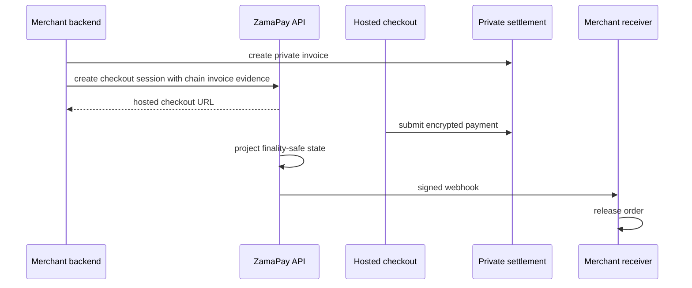

## Privacy target 

Private checkout protects buyer payment amount handling on the Zama private rail. It does not hide every business fact from the merchant or platform.

| Item | Boundary |
| --- | --- |
| Buyer payment amount | Encrypted into the private payment path. |
| Merchant order id | Visible to merchant backend and ZamaPay for reconciliation. |
| Hosted checkout URL | Publicly reachable by the buyer with an unguessable session id. |
| Finality state | Visible because fulfillment depends on it. |

## MVP boundary 

The active MVP is local-dev FHEVM/cUSDT. Public testnet enablement stays behind explicit runtime profiles and env files.

| Layer | Implemented shape |
| --- | --- |
| Contract | Merchant registry, confidential token mock, private checkout settlement. |
| Frontend | Hosted checkout submits private payment through the buyer wallet. |
| Backend | Project checkout sessions, finality projection, webhook release, withdraw read models. |
| Demo | CardForge uses raw HTTP and verifies Svix-style webhooks. |

## Field contract 

Private checkout creation requires the private invoice evidence.

| Field | Meaning |
| --- | --- |
| `paymentRail` | Must be `zama_private`. |
| `chainInvoiceId` | Private settlement invoice id created before platform checkout session creation. |
| `chainTxHash` | Transaction hash that created the private chain invoice. |
| `amountMinorUnits` | Minor cUSDT units used for dashboard and fulfillment accounting. |

## Payment flow 

## Safety controls 

| Control | Purpose |
| --- | --- |
| Rail-explicit checkout creation | Prevents private and ERC20 fields from blending. |
| Local-dev runtime profiles | Keeps public-testnet paths explicit. |
| Raw-body webhook signatures | Prevents JSON reserialization from validating. |
| Merchant-signed withdraw | Keeps project owner authority on fund movement. |

## Acceptance criteria 

1. The checkout session records `paymentRail: "zama_private"`.
2. The buyer can submit a local private payment from hosted checkout.
3. The project dashboard reaches paid and finality-safe state.
4. The webhook delivery is signed with `svix-*` headers.
5. The merchant can withdraw only through the project owner wallet path.
