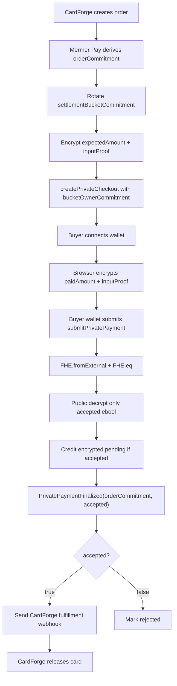
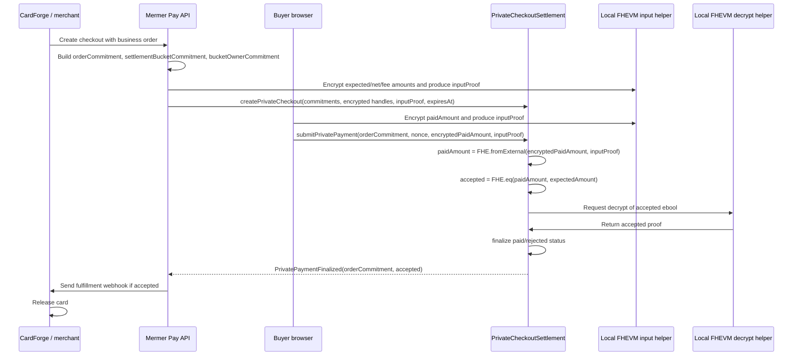

# Private Checkout v1

## Purpose

Private Checkout v1 is the hackathon slice for proving a private checkout moment without turning the whole merchant platform into a blind settlement system.

The demo must prove one clean case:

- `PrivateCheckoutSettlement` checkout creation, payment storage, and payment events do not expose the merchant or payout wallet.
- `PrivateCheckoutSettlement` storage and events do not expose the amount.
- `PrivateCheckoutSettlement` storage and events do not expose the project id or merchant order id.
- Mermer Pay can still know whether a checkout was paid and can trigger CardForge fulfillment.

This is a **Private Checkout Proof MVP**, not a full private settlement network. It proves encrypted amount validation, a private fulfillment trigger, encrypted merchant pending balance, and merchant-authorized withdraw. Local-dev uses `ConfidentialUSDMock`, an official-style mintable confidential token mock, so the demo proves a mock cUSDT debit without making cUSDT a MetaMask ERC20 token.

The privacy claim is scoped to business data in `PrivateCheckoutSettlement`. In the direct-wallet payment MVP, the buyer wallet is still visible as the EVM transaction sender. Withdraw is merchant-signed and may reveal the authorized recipient in calldata; v1 does not claim payout-recipient privacy. Token wrapping, funding, gas payment, and any future confidential-token transfer can also leak address relationships if their own contracts expose `from`, `to`, or receiver events. Mermer Pay may keep the checkout/order mapping needed for the demo. A future merchant-only data model can remove that trust assumption.

Mermer Pay does not run a product-owned relayer in the MVP. Browser/local-dev code uses the chain's FHEVM relayer RPC methods for encrypted input proofs and public decrypts. The only local server submitter is a Hardhat test shim for deterministic local-dev transactions; Sepolia should replace that shim with Zama/chain relayer surfaces.

## MVP Layers

| Layer | What it proves | v1 position |
| --- | --- | --- |
| Private Checkout Proof | `expectedAmount` and `paidAmount` stay encrypted, the contract checks `FHE.eq`, and only `accepted` becomes public. | Required for the hackathon demo. |
| Payment Rail | The buyer has actually paid, or the demo has honestly simulated that settlement. | Implemented as mock confidential cUSDT balance on local-dev. |
| Merchant Settlement / Withdraw | Merchant net accrues as an encrypted aggregate and can be moved by a merchant-signed authorization without per-order amount disclosure. | Implemented for local-dev; payout-recipient privacy is not claimed in v1. |

## Privacy Model

| Data | Public chain treatment | Who can know it in v1 | Reason |
| --- | --- | --- | --- |
| Buyer wallet | Direct payment submits as `msg.sender`; not stored as an order/business field | Public chain observers can see the transaction sender; Mermer Pay can map the checkout | Payer hiding is explicitly post-MVP. |
| Merchant wallet | Checkout uses a bucket-owner commitment; withdraw uses merchant signature authorization | Mermer Pay, merchant backend, and observers of the withdraw authorization | v1 proves checkout amount/order privacy, not full payout-recipient privacy. |
| Payout wallet | Withdraw recipient is authorized by merchant signature | Merchant backend and observers of the withdraw calldata | v1 keeps checkout amounts private but does not hide withdraw recipient. |
| Project id / order id | Hashed into `orderCommitment` | Mermer Pay and merchant backend | Keep business identifiers off-chain. |
| Gross amount | Stored as encrypted `expectedAmount` | Mermer Pay in v1; encrypted on-chain | Contract can validate payment without exposing price. |
| Paid amount | Submitted as encrypted `paidAmount` | Buyer before encryption; encrypted on-chain | Contract can compare payment to expected amount. |
| Merchant net | Encrypted accumulator outside the per-checkout struct | Merchant dashboard projection; encrypted on-chain | Avoid per-order public split disclosure. |
| Platform fee | Encrypted accumulator outside the per-checkout struct | Platform projection; encrypted on-chain | Avoid per-order public fee disclosure. |
| Paid/rejected status | Public boolean after decrypting `accepted` | Everyone | Fulfillment needs a public finality signal. |

## Vocabulary

| Term | Meaning |
| --- | --- |
| On-chain encrypted | The value exists on-chain as an FHE ciphertext handle. Contracts can compute over it, but observers cannot read it. |
| Not public on-chain | The raw value never appears on-chain. It is either kept off-chain, represented by a commitment, or represented by an encrypted handle. |
| Commitment | A one-way hash that lets Mermer Pay correlate an order without revealing the raw order id, project id, merchant, buyer, or amount. |
| Settlement bucket commitment | A rotating commitment-like settlement identifier used to group encrypted merchant balances without publishing wallet addresses or a long-lived merchant graph. |
| Bucket owner commitment | `hash(settlementBucketCommitment, ownerAddress)`, used during checkout creation so the raw merchant wallet is not submitted until the merchant later signs withdraw. |

## Field Contract

<table>
  <thead>
    <tr>
      <th>Boundary</th>
      <th>Field</th>
      <th>Type</th>
      <th>Meaning</th>
      <th>Public rule</th>
    </tr>
  </thead>
  <tbody>
    <tr>
      <td rowspan="6">On-chain encrypted, v1 core</td>
      <td><code>expectedAmount</code></td>
      <td><code>euint64</code></td>
      <td>Order amount due.</td>
      <td>Stored only as an FHE handle; never emitted as plaintext.</td>
    </tr>
    <tr>
      <td><code>merchantNetAmount</code></td>
      <td><code>euint64</code></td>
      <td>Merchant net split for this checkout.</td>
      <td>Imported with the same input proof; only added to encrypted pending if the payment succeeds.</td>
    </tr>
    <tr>
      <td><code>platformFeeAmount</code></td>
      <td><code>euint64</code></td>
      <td>Platform fee split for this checkout.</td>
      <td>Imported with the same input proof; only added to encrypted pending if the payment succeeds.</td>
    </tr>
    <tr>
      <td><code>splitCheck</code></td>
      <td><code>ebool</code></td>
      <td>Encrypted result of <code>merchantNetAmount + platformFeeAmount == expectedAmount</code>.</td>
      <td>Never decrypted per order; it gates payment acceptance.</td>
    </tr>
    <tr>
      <td><code>paidAmount</code></td>
      <td><code>externalEuint64</code></td>
      <td>Buyer-submitted payment amount.</td>
      <td>Submitted with <code>inputProof</code>; imported through <code>FHE.fromExternal</code>.</td>
    </tr>
    <tr>
      <td><code>paymentCheck</code></td>
      <td><code>ebool</code></td>
      <td>Encrypted result of <code>paidAmount == expectedAmount</code>.</td>
      <td>Only this boolean is publicly decrypted as <code>accepted</code>.</td>
    </tr>
    <tr>
      <td rowspan="2">On-chain encrypted, v1 settlement</td>
      <td><code>encryptedMerchantPending[settlementBucketCommitment]</code></td>
      <td><code>euint64</code></td>
      <td>Merchant aggregate settlement balance.</td>
      <td>Accrued by accepted checkouts; moved by merchant-authorized encrypted withdraw.</td>
    </tr>
    <tr>
      <td><code>encryptedPlatformPending</code></td>
      <td><code>euint64</code></td>
      <td>Platform aggregate fee balance.</td>
      <td>Fee balance stays encrypted until platform settlement is explicitly added.</td>
    </tr>
    <tr>
      <td rowspan="7">On-chain public</td>
      <td><code>orderCommitment</code></td>
      <td><code>bytes32</code></td>
      <td><code>hash(orderId, projectId, amount, salt)</code>.</td>
      <td>Stable order reference only; raw ids and amount stay off-chain.</td>
    </tr>
    <tr>
      <td><code>settlementBucketCommitment</code></td>
      <td><code>bytes32</code></td>
      <td><code>hash(merchantId, settlementEpoch, randomSalt)</code>, not merchant address.</td>
      <td>Rotate by checkout, batch, day, or week; never use a permanent merchant identifier.</td>
    </tr>
    <tr>
      <td><code>bucketOwnerCommitment</code></td>
      <td><code>bytes32</code></td>
      <td><code>hash(settlementBucketCommitment, bucketOwner)</code>.</td>
      <td>Submitted during checkout creation instead of the raw merchant wallet.</td>
    </tr>
    <tr>
      <td><code>paymentStatus</code></td>
      <td><code>enum</code></td>
      <td><code>created / submitted / accepted / rejected / expired</code>.</td>
      <td>Coarse fulfillment state; no counterparty or amount data.</td>
    </tr>
    <tr>
      <td><code>expiresAt</code></td>
      <td><code>uint64</code></td>
      <td>Checkout deadline.</td>
      <td>Public time bound used to reject stale payment attempts.</td>
    </tr>
    <tr>
      <td><code>paidAt</code></td>
      <td><code>uint256</code></td>
      <td>Finalization timestamp.</td>
      <td>Time signal only; do not pair it with raw order or wallet fields.</td>
    </tr>
    <tr>
      <td><code>buyer tx sender</code></td>
      <td><code>address</code></td>
      <td>The wallet that submits <code>submitPrivatePayment</code> in the direct MVP.</td>
      <td>Public because of EVM mechanics; do not claim payer-address privacy in this MVP.</td>
    </tr>
    <tr>
      <td rowspan="7">Never public in checkout calldata/events</td>
      <td><code>merchant address</code></td>
      <td><code>address</code></td>
      <td>Merchant wallet or dashboard identity.</td>
      <td>Checkout events do not emit it; withdraw authorization may reveal it.</td>
    </tr>
    <tr>
      <td><code>payout wallet during checkout</code></td>
      <td><code>address</code></td>
      <td>Settlement destination.</td>
      <td>Never include in checkout creation or payment submission; v1 withdraw recipient is public calldata.</td>
    </tr>
    <tr>
      <td><code>amountDue plaintext</code></td>
      <td><code>uint64 / token minor units</code></td>
      <td>Plain order amount.</td>
      <td>Use encrypted <code>expectedAmount</code> or an order commitment instead.</td>
    </tr>
    <tr>
      <td><code>merchantNet plaintext</code></td>
      <td><code>uint64 / token minor units</code></td>
      <td>Plain merchant net split.</td>
      <td>Use encrypted merchant pending and merchant-only dashboard projection.</td>
    </tr>
    <tr>
      <td><code>platformFee plaintext</code></td>
      <td><code>uint64 / token minor units</code></td>
      <td>Plain platform fee split.</td>
      <td>Use encrypted platform pending and platform-only projection.</td>
    </tr>
    <tr>
      <td><code>projectId plaintext</code></td>
      <td><code>string / bytes</code></td>
      <td>Mermer Pay project id.</td>
      <td>Hash into <code>orderCommitment</code>; never store the raw business id.</td>
    </tr>
    <tr>
      <td><code>orderId plaintext</code></td>
      <td><code>string / bytes</code></td>
      <td>Merchant order id.</td>
      <td>Hash into <code>orderCommitment</code>; never store the raw order id.</td>
    </tr>
  </tbody>
</table>

## On-Chain Shape

```solidity
struct PrivateCheckout {
    bytes32 orderCommitment;
    bytes32 settlementBucketCommitment;
    euint64 expectedAmount;
    euint64 merchantNetAmount;
    euint64 platformFeeAmount;
    ebool splitCheck;
    ebool paymentCheck;
    PaymentStatus status;
    uint64 expiresAt;
    uint256 paidAt;
}
```

Public events must not include raw buyer, merchant, payout wallet, project id, order id, or amount.

```solidity
event PrivateCheckoutCreated(bytes32 indexed orderCommitment, bytes32 indexed settlementBucketCommitment);
event PrivatePaymentSubmitted(bytes32 indexed orderCommitment, bytes32 paymentCheckHandle);
event PrivatePaymentFinalized(bytes32 indexed orderCommitment, bool accepted, uint256 paidAt);
event PrivateMerchantPendingCredited(bytes32 indexed orderCommitment, bytes32 indexed settlementBucketCommitment, bytes32 merchantPendingHandle);
event PrivateWithdrawSubmitted(bytes32 indexed settlementBucketCommitment, bytes32 indexed withdrawalNonce, bytes32 withdrawCheckHandle);
```

`settlementBucketCommitment` must rotate by checkout, settlement epoch, batch, or another high-entropy salt. A permanent merchant bucket hides the wallet address but leaks a business graph. The checkout creator passes `bucketOwnerCommitment = hash(settlementBucketCommitment, merchantOwner)` instead of a raw merchant address.

Settlement accumulators belong outside the checkout record:

```solidity
mapping(bytes32 settlementBucketCommitment => euint64) encryptedMerchantPending;
mapping(bytes32 settlementBucketCommitment => euint64) encryptedPlatformPending;
```

## Payment Rail Boundary

`FHE.eq(paidAmount, expectedAmount)` proves only that someone submitted an encrypted amount equal to the expected amount. It does **not** prove that money moved. The MVP must name the selected rail so the demo is honest.

| Rail | What it proves | Use in hackathon |
| --- | --- | --- |
| Direct mock cUSDT confidential balance | Buyer has a demo confidential balance and the buyer-submitted transaction deducts an encrypted amount. | Implemented local-dev path. |
| ERC-7984 / confidential wrapper transfer | Confidential token balance or transfer amount moves through a token contract. | Post-MVP unless address-linkage and operator semantics are deliberately handled. |

If the rail is mock/demo balance, the product name should be `Private Checkout Proof MVP`. If the rail actually debits mock cUSDT, the demo can claim private checkout plus demo confidential payment rail. Do not claim full merchant settlement until withdraw and asset finality exist.

Local-dev issues mock cUSDT the same way the Zama `fhevm-mocks` `ConfidentialERC20Mintable` examples do: a clear test amount is minted on-chain into an encrypted `euint64` balance. CardForge's wallet card exposes this as a faucet. The buyer clicks `+`, signs `ConfidentialUSDMock.claimTestTokens()` in MetaMask, and receives 1000 test cUSDT on the local chain.

## Flow

1. CardForge creates an order; Mermer Pay derives `orderCommitment`.
2. Mermer Pay derives a rotating `settlementBucketCommitment` and `bucketOwnerCommitment`.
3. Mermer Pay encrypts `expectedAmount`, `merchantNetAmount`, and `platformFeeAmount` with the local FHEVM input helper and calls `createPrivateCheckout` with encrypted handles plus one `inputProof`.
4. The buyer connects a wallet on the hosted checkout page.
5. The browser encrypts `paidAmount` through the local Hardhat/FHEVM mock RPC and obtains `encryptedPaidAmount + inputProof`.
6. The buyer wallet submits `submitPrivatePayment` directly. The transaction sender is the buyer in this MVP.
7. The contract imports the encrypted input with `FHE.fromExternal` and checks:

```solidity
accepted = FHE.eq(paidAmount, expectedAmount);
```

8. Each order publicly decrypts only one value: `accepted ebool`.
9. If accepted, the contract credits encrypted merchant/platform pending buckets before finalization is projected.
10. Mermer Pay listens for `PrivatePaymentFinalized(orderCommitment, accepted)`.
11. If `accepted` is true, Mermer Pay maps `orderCommitment` to the CardForge order off-chain, sends the webhook, and CardForge releases the card.
12. Amounts are not decrypted per order. Merchant dashboard projects business totals from its order ledger and uses encrypted pending for chain withdraw checks.





## Fee Touchpoints

| Step | Zama protocol fee | Frequency | Optimization |
| --- | --- | --- | --- |
| Submit `expectedAmount` encrypted input | ZKPoK verification | Once per checkout | Local-dev is free in Hardhat; Sepolia should use Zama official relayer/gateway policy. |
| Submit `merchantNetAmount` and `platformFeeAmount` encrypted inputs | ZKPoK verification | Once per checkout | Keep splits encrypted and validate `net + fee == gross`. |
| Submit `paidAmount` encrypted input | ZKPoK verification | Once per payment attempt | Direct-wallet local-dev keeps Mermer-owned relayer out of scope. |
| Decrypt `accepted` | Decryption | Once per payment attempt | Decrypt only one `ebool`, not amounts. |
| Submit encrypted withdraw amount | ZKPoK verification | Once per withdraw request | Merchant signs authorization; local-dev submitter only forwards the package. |
| Decrypt withdraw check | Decryption | Once per withdraw request | Decrypt only one `ebool`, not the aggregate amount. |
| Decrypt platform fee aggregate | Decryption | Future platform settlement | Batch fees with settlement accounting. |
| Bridge ciphertext | Bridging | Not in v1 | Keep v1 single-chain. |

Do not decrypt per-order gross, merchant net, or platform fee in the normal checkout path. That destroys the cost model.

## Demo Acceptance Criteria

1. A CardForge checkout creates one private checkout on `local-dev`.
2. `PrivateCheckoutSettlement` storage and events expose only commitments, encrypted handles, status, and timestamps.
3. The buyer wallet submits the encrypted payment directly in local-dev.
4. No raw merchant address, payout wallet, project id, order id, or amount appears in checkout creation, payment submission, payment storage, or payment events.
5. The contract validates `paidAmount == expectedAmount` with FHE.
6. The contract publicly finalizes only `accepted`.
7. Mermer Pay maps `orderCommitment` back to the demo order and sends the CardForge fulfillment webhook.
8. CardForge records the fulfillment-ready event and releases the card.
9. The selected payment rail is explicitly labeled as mock cUSDT confidential balance on local-dev.
10. Merchant withdraw requires a wallet signature over bucket, nonce, owner, recipient, encrypted amount handle, input proof hash, deadline, chain id, and settlement contract.
11. A payment or withdraw cannot be replayed, submitted after expiry, resubmitted after accepted/rejected, or finalized twice.

## Explicit Non-Goals

| Non-goal | Reason |
| --- | --- |
| Platform-blind merchant-only order data | Too much scope for the hackathon demo; requires merchant-owned encryption and blind fulfillment mapping. |
| Payout-recipient privacy | v1 withdraw authorizes a recipient in calldata; hiding payout recipients requires a later account-abstraction or confidential settlement layer. |
| Per-order amount decrypt | Too expensive and unnecessary for fulfillment. |
| Cross-chain ciphertext movement | Adds bridge fees and operational risk. |
| Public merchant dashboard with exact encrypted settlement reads | Can be built from batch settlement later. |

## Design Rules

- Scope privacy claims to `PrivateCheckoutSettlement` until the payment rail is also privacy-reviewed.
- Never pass merchant or payout wallet as plain checkout creation or payment parameters; use bucket owner commitments for checkout setup.
- Do not claim payer-address privacy while the buyer wallet is the transaction sender.
- Never emit raw amount in settlement events.
- Never store `externalRef` as a string on-chain.
- Use high-entropy salts for commitments; do not hash predictable ids alone.
- Rotate `settlementBucketCommitment`; do not use one permanent merchant bucket.
- Keep `accepted` as the only per-order decrypted value.
- Reject expired checkouts, reused payment nonces, resubmission after final status, and double finalization.
- Keep Mermer Pay platform relayer out of the MVP. Local-dev uses Hardhat/FHEVM mock RPC plus a server submitter for merchant-signed withdraw packages; future Sepolia uses Zama official relayer/gateway surfaces for FHE operations.
- Keep local-dev clean: no transparent settlement fallback and no public-testnet branch in the active app.

## Implementation Direction

The private checkout path is implemented as:

```text
PrivateCheckoutSettlement
```

The old transparent invoice settlement has been removed from the active local-dev path because it stored merchant, payout, payer, and amount fields publicly. Keeping it available as a fallback would make the privacy claim ambiguous.

The local-dev cUSDT token is implemented as:

```text
ConfidentialUSDMock
```

That token keeps the MVP simple: buyer faucet balance, encrypted checkout debit, direct buyer wallet submission, merchant-signed encrypted withdraw, and no merchant/order/amount in checkout payment events. Real ERC20 wrapping, payer-address hiding, and payout-recipient hiding remain post-MVP.
