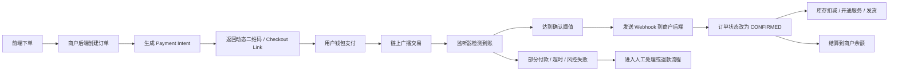

# 收款场景与主流 Crypto 收款平台收费模型研究报告

## 执行摘要

如果把“收款”拆开看，真正需要设计的不是一个统一的“支付入口”，而是至少八类不同的业务流：静态二维码、动态二维码/订单绑定支付、订阅与周期扣费、发票/账单、POS 线下收银、批量结算/代付、隐私/保密支付，以及法币 on/off-ramp。它们在“谁先生成支付请求、金额是否锁定、地址是否复用、如何确认到账、谁承担退款与合规责任”这五个问题上的答案完全不同，因此产品、计费、风控和结算策略也必须分层设计。主流平台的公开产品页和文档基本都沿着这条线演化：订单型收款强调 link / checkout / webhook，订阅型收款强调 recurring invoice 或预存余额自动扣费，线下场景强调 POS link，ramp 则强调 KYC、支付方式覆盖和资金出入金时效。citeturn10search2turn10search5turn14search1turn17search0turn19search3turn19search5turn12view0turn16search1

从公开费率看，原生链上稳定币收款已经进入非常透明的低费竞争区：urlInfiniturn10search4公开为 0.3% flat fee；urlCryptomusturn1search10的官方公开信息显示商户费可低至 0.4%；urlNOWPaymentsturn4search9公开为 0.5% 单币种、1% 换币；urlCoinPaymentsturn5search1公开为 0.5% 起，部分模式再叠加链上网络费；而截至 **2026 年 5 月 7 日**，urlCoinbase Commerce / Coinbase Businessturn14search7的官方帮助页显示 Commerce 正在向 Business 迁移，迁移商户维持 1% 交易费。与之相对，urlMoonPayturn6search7和 urlTransakturn7search7 这类 ramp 基础设施的费用通常不是固定统一的公开 MDR，而是受支付方式、地区、风控、KYC、欺诈、链上成本等因素动态影响。citeturn10search4turn26search14turn4search9turn5search1turn3search0turn6search0turn8search0

这意味着，若你在 urlZamaturn28search3 上做一个目标类似 Cryptomus、Infini、AllScale 的收款平台，单纯继续价格战并不足够。真正有机会形成差异化的，不是再把费率从 0.4% 打到 0.25%，而是把 **“可编程合规 + 保密结算 + 商户级状态机”** 做成产品层级能力。Zama 官方 litepaper 与协议文档明确把“confidential payments”“encrypted balances and transfer amounts”“programmable compliance”作为核心用例和能力，这正好对冲了当前主流平台在公开文档中普遍缺少的“shielded/zk 级商户收款标准化产品”。citeturn28search0turn28search3turn28search8turn28search11

从成本角度看，链上原生收款的竞争优势主要来自避免传统跨境支付和卡网络的一层费用，但一旦引入换币、法币提现或卡入金，成本会迅速上升。世界银行 Remittance Prices Worldwide 报告显示，**Q3 2025** 小额跨境汇款里，卡资金来源平均成本为 4.39%，银行账户资金来源平均成本为 8.69%；FSB 也指出零售跨境支付成本在不同地区和轨道间差异巨大，卡类支付在一些地区对商户可高于 7%。这解释了为什么链上稳定币收款可以做到 0.3%–1%，但 ramp 侧通常仍需动态报价或把部分成本传递给终端用户。citeturn20search8turn20search20

基于这些公开事实，本报告的核心建议是：**默认产品不要做成“一套费率打所有场景”，而要做成“三层结构”**。底层用免费月费 + 0.5% 成功收款抽水降低接入门槛；中层对账单、订阅、POS、代付等复杂场景按工作量加价或通过付费计划降低费率；高层把 Zama 的 confidential payment 做成 premium SKU 或按场景附加费。默认 launch 费率可以考虑：Free 版 0 月费 + 0.5% 成功收款抽水，Growth 版 $99/月 + 0.25% 基础 checkout，Enterprise 从 0.20% 起谈量，批量代付 0%–0.15% + gas pass-through，ramp 走合作方 pass-through + 平台编排费，confidential checkout 额外加收 10–25 bps 或进入付费套餐。citeturn10search4turn26search14turn4search9turn5search1turn3search0turn24view0turn28search0

## 研究范围与假设

本报告以“全球市场、以美元计价”为基准，重点比较商户收款产品，而不是交易所、钱包或纯托管产品本身；法币 on/off-ramp 被视为收款链路的补充能力，而非替代链上 checkout 的核心。由于用户未指定目标司法区，合规部分只给出一般框架，实际落地仍需按目标国家、币种、客户类型与是否触发托管/换汇/转付重新评估。对于“是否构成 money transmitter / VASP / MSB”这类高敏感问题，应以目标司法区律师意见为准。citeturn27search2turn27search3turn27search6turn27search19

本报告主要基于官方产品页、开发者文档、定价/帮助中心页面，包括：urlCryptomus API 文档turn1search10、urlInfini 支付页turn10search4、urlAllScale 定价页turn24view0、urlCoinbase Business 文档turn14search7、urlMoonPay Rampsturn6search7、urlTransak 文档turn7search7、urlNOWPayments 定价页turn4search9、urlCoinPayments 费用页turn5search1，以及 FATF、FinCEN、OFAC、世界银行与 FSB 的公开材料。对于公开页未明确披露的项目，本报告统一标记为“未公开”或“动态”，而不做臆测填补。citeturn27search2turn27search6turn20search8turn20search20

一个必须提前明确的合规判断是：如果你的平台只是帮助商户生成订单、监听链上状态并把资金直接送入商户自有地址，监管负担与“先收后转”“代客换汇”“代客提现”“法币出入金”是两回事。FinCEN 对 CVC payment processor 的公开指引明确提到，收款处理方若代客户接收并转付，通常会落入 money transmitter 讨论范围；FATF 则持续强调虚拟资产服务提供者的 AML/CFT、Travel Rule 与风险为本监管要求；OFAC 则要求相关主体建立制裁筛查与拦截能力。也就是说，**收款 orchestration、本地稳定币结算、法币 on/off-ramp、代付结算** 不应放在同一法律抽象层里。citeturn27search2turn27search3turn27search6turn27search8turn27search19

## 收款场景分类

先把你前面提到的“扫码支付”和“后端指定商品支付”讲清楚。它们不是“同一个东西换个 UI”，而是三种任务边界不同的产品模式。

| 维度 | 静态二维码 | 动态二维码 | 后端订单绑定支付 |
|---|---|---|---|
| 支付请求是谁创建 | 商户预先固定一个地址 / link | 后端按本次交易生成一次性支付请求 | 后端先创建订单，再把支付请求绑定到该订单 |
| 金额是否锁定 | 通常不锁定，或靠用户手输 | 锁定，带过期时间 | 锁定，且和商品、税费、库存、客户信息一起锁定 |
| 对账粒度 | 以地址、备注、唯一尾差或人工核对为主 | 以 payment intent / invoice 为主 | 以 orderId / invoiceId / txHash 三元组为主 |
| 最适合场景 | 展会、打赏、简易线下码牌 | 一次性线上支付、收银台 | 电商、SaaS、物流、库存扣减、售后闭环 |
| 技术难点 | 归因与误支付 | 到账监听与锁价过期 | 回调幂等、状态机、库存/发货/退款联动 |

上表的差异，本质上也能从主流产品形态里看到：Cryptomus 明确区分 invoice、static wallet、QR-code 与 recurring payment；Infini 以 hosted checkout + webhook 作为推荐接入方式；Coinbase Business 主推 payment links / checkouts / invoices；NOWPayments 既有 invoices，也有 POS、subscriptions 与 billing。citeturn12view0turn10search2turn10search8turn14search1turn14search5turn19search1turn19search3turn19search5

下表把主要收款场景做成产品与工程视角的分类。这里的“后端实现要点”是结合主流平台公开文档与通用支付架构抽象出来的建议实现，而“安全/合规重点”则参考 FATF、FinCEN、OFAC 的公开要求与 ramp 平台的合规设计。citeturn17search0turn19search0turn16search1turn27search2turn27search6turn27search19

| 收款场景 | 典型用户流程 | 后端实现要点 | 安全 / 合规重点 | 适合资产类型 |
|---|---|---|---|---|
| 静态二维码收款 | 用户扫固定码，输入金额或按牌价支付，商户端核对到账 | 固定地址/固定 link；用备注、唯一尾差、payer session 或线下收银员确认做归因；低金额可走 0–1 确认风控，高金额需更严格确认；退款通常手动发起 | 误付、重复付、地址污染、找零困难；制裁地址筛查、黑名单钱包拦截；不适合复杂售后 | 快速链稳定币最优，例如 entity["cryptocurrency","USDC","stablecoin"]、entity["cryptocurrency","USDT","stablecoin"]；也可支持原生链 token；若做隐私版需额外合规层 |
| 动态二维码 / 订单绑定支付 | 商户后端生成订单，返回二维码或支付页，用户支付后订单状态更新 | 核心是 `create order → lock amount → expiry → detect tx → confirm → callback → settle`；必须有 webhook 幂等、订单过期、少付/多付/晚付分支、库存锁定与释放；建议使用独立 payment intent，而不是只靠地址复用 | 防止回调重放、伪回调、少付发货、超时订单占库存；链路中任何换币/托管步骤都会提高合规门槛 | 稳定币优先；如支持 entity["cryptocurrency","Bitcoin","BTC cryptocurrency"] 等波动资产，需更短报价有效期 |
| 订阅 / 周期扣款 | 用户首次开通，后续按周期续费 | 重点不是“自动扣链上钱包”，而是分清三种模式：周期性发票、余额预付自动扣费、或托管权限式扣费；要有 dunning、失败重试、续费通知、暂停/恢复状态机 | 是否需要 KYC、如何证明用户授权、取消订阅后的停服务逻辑、失败重试频次、消费者保护义务 | 稳定币最适合；波动币不适合长期订阅计费；余额式方案优于直接 pull |
| 发票 / 账单支付 | 商户发 invoice 或账单链接，客户稍后支付 | 后端需支持 invoice profile、到期日、账单状态、部分付款、附言、PDF/邮件或 shareable link，以及应收账款对账；适合 B2B 与 freelancer | 抬头、税费、账单追踪、客户身份验证；若支持信用卡 / 电汇付款，再转成稳定币，则需第三方支付与 AML 编排 | 稳定币 + 法币入口最实用；链上与电汇并存效果最好 |
| POS / 线下收银 | 收银员输入金额，终端展示码，顾客当场支付 | 需要 cashier session、门店终端、金额快速生成、弱网容错、设备锁屏、零钱/小费逻辑、门店级对账；建议金额小、笔数多场景采用低确认数 + 风控模型 | 门店误操作、双收款、终端丢失、假回执；按门店/收银员分权限；受制裁钱包拦截 | 低费、快确认稳定币最适合；不建议高波动资产做日常 POS |
| 批量结算 / 代付 | 平台向商户、分销商、创作者或员工批量付款 | 要有 payout batch、收款人档案、名单导入、批次状态、部分失败重试、费用归属、收款地址白名单；如果进入法币银行卡，则实际上进入 payout / remittance 产品 | KYB/KYC、名单筛查、Travel Rule、地址白名单、审核与审批链；这是最容易触发高监管负担的场景之一 | 稳定币、尤其跨境工资/赏金/分润；法币代付建议与受监管合作方对接 |
| 隐私 / 保密支付 | 用户和商户都不希望公开暴露金额、余额、对手方关系 | 用 confidential token / encrypted balance 维护收款 intent；把 selective disclosure、审计解密、阈值披露做成协议能力；回调只暴露状态不暴露明文金额 | 不是“匿名无监管”，而是“合规可选择披露”；需要审计密钥、访问控制、合规开关与证据留存 | 保密稳定币最适合；隐私币如 entity["cryptocurrency","Monero","privacy cryptocurrency"] 只适合部分司法区且合规差异大 |
| 法币 on/off-ramp 场景 | 无钱包用户用卡/银行买币完成支付，或商户把收款换回法币 | 本质是收款编排：先 quote，再 KYC / payment method，完成后把稳定币打到订单地址或商户余额；off-ramp 则要分“商户法币结算”和“终端用户 cashout”两类 | KYC/KYB、欺诈、拒付、退款、地区限制、支付方式限额、银行合规；这是成本与风控最重的一层 | 法币 ↔ 稳定币；对商户来说最好仍然以稳定币作为内部记账和结算底层 |

一个很重要的产品判断是：**不要把“隐私支付”设计成“绕过审计”的能力，而要设计成“默认保密、按规则可披露”的能力**。Zama 协议文档反复强调的是 confidential and compliant payments，而不是传统 mixer 式匿名。对商户平台来说，这比单纯接入隐私币更可经营，也更容易进入企业与合规市场。citeturn28search0turn28search3turn28search11

## 主流平台能力与收费对比

截至 **2026 年 5 月 7 日**，主流平台已经明显分成三类：第一类是低费原生 crypto gateway，典型如 Cryptomus、Infini、NOWPayments、CoinPayments；第二类是“invoice / payroll / stablecoin business OS”型，典型如 AllScale；第三类是把法币出入金能力做成嵌入式基础设施的 ramp，典型如 MoonPay 与 Transak。Coinbase 则处于从旧 Commerce 向 Business API/Checkouts 迁移的过渡阶段。citeturn3search0turn24view0turn6search7turn7search7

| 平台 | 主要支持场景 | 费率结构 | 结算周期 / 限额 | 退款 / 争议 | 隐私支持 | 集成复杂度 | 官方公开依据 |
|---|---|---|---|---|---|---|---|
| urlCryptomusturn1search10 | invoice、static wallet、QR code、refund、payout、recurring payment；官方内容还提到 mass payouts、auto-convert、20+ 插件 | 公开信息显示商户费可低至 **0.4%**，提款与 mass payouts 公开信息显示可为 0% | 公开页强调按链上确认入账；支持 static wallet 与业务钱包，但未见统一公开 min/max 与法币 T+ 说明 | 文档有 refund API；未见统一公开争议 SLA | 未见原生 shielded / zk 商户标准公开；更像多币种 + 商户工具 | 低到中；文档齐全，插件多 | citeturn12view0turn26search14turn26search1 |
| urlInfiniturn10search4 | hosted checkout、500+ wallets、Binance Pay、自动 SaaS subscriptions、webhook、order expiration | **0.3% flat fee**；页面宣称“instant settlement” | 页面明确“upon block confirmation”即可访问资金；未见统一 min/max 公开；订单支持 expiry | webhooks 覆盖订单与订阅状态；未见集中公开退款/争议政策页 | 未见 shielded / zk 支持公开；以稳定币 checkout 为主 | 低；官方最推荐 hosted checkout + webhook | citeturn10search4turn10search2turn10search5turn10search9turn10search13 |
| urlAllScaleturn9search0 | checkout、invoice、social commerce、payroll、global settlement；invoice 可接受信用卡、电汇、链上并结算为稳定币 | 定价页公开为 **Business $15/月、Individual $5/月、One-time Invoice 免费**；但 FAQ 说明 invoice 展示金额会包含 gas 与 service fee，交易级统一费率未完整公开 | 官网页面强调 instant stablecoin settlement；硬性 min/max 未公开 | 未见统一公开退款/争议 SLA；更偏业务 OS 而非传统支付仲裁体系 | 强调 KYC/KYB/KYT 与支付保密营销，但未见可核验的 shielded/zk 商户 API 标准公开 | 中；签名 API、Checkout Intent、Webhook 等更像自建平台能力 | citeturn24view0turn25search17turn25search18turn25search10turn25search4 |
| urlCoinbase Commerce / Businessturn14search7 | Payment Links、Checkouts、Invoices、API、Sandbox；旧 Commerce 正迁移到 Business | 官方帮助页显示 **1% transaction fee**；迁移商户维持 1% | **截至 2026-05-07**，Business 当前面向 entity["country","美国","country"] 与 entity["country","新加坡","country"] 商业实体开放；统一 min/max 未公开 | 公开页未见集中商户退款 SLA；更侧重 link/invoice/settlement 到 Coinbase 账户 | 公开文档未见 shielded / zk；当前更偏 EVM / USDC 体系 | 中；JWT、Business API、Checkouts/Payment Links/Invoices | citeturn3search0turn14search1turn14search5turn13search0turn2search7 |
| urlMoonPayturn6search7 | on-ramp、off-ramp、widget、SDK、API、webhooks；另有 MoonPay Commerce 自助商户能力 | ramp 费用**动态**，官方披露其 fee 受 order type、payment method、location、fraud/KYC/chargeback 等影响；MoonPay Commerce FAQ 显示 self-serve **1% 或 2%**，另有 swaps 0.25%、auto-offramp 0.5% | 官方帮助页给出处理时效：卡支付数分钟到数小时，UK bank transfer 1 个工作日内，SEPA 3 个工作日，ACH 4–5 个工作日；限额按账户和支付方式滚动重置 | 失败交易退款通常 **10 个工作日内**；卡类支付天然承接退款/拒付工作流 | 不主打隐私，主打 KYC、fraud protection、global coverage | 中；SDK 完整，但商业与合规依赖 MoonPay 审核与地区规则 | citeturn6search0turn6search7turn16search1turn15search0turn15search3turn15search14turn6search21 |
| urlTransakturn7search7 | on-ramp、off-ramp、widget、whitelabel API、webhooks、WebSockets、KYC reliance | 官方未给统一标准费率；费用由 **Transak fee + network/exchange/processing fee + partner fee** 组成；bank transfer 场景 Transak fee 不低于 **1 EUR/GBP**；企业价格按 corridor / payment method / volume 动态 | off-ramp stream 官方说明通常可在数分钟内到账；SEPA 普通转账可 1–3 个工作日；限额与费用按地区/方法动态页展示 | 退款与费用变化主要由具体支付方法、订单状态与客服支持流程决定；未见统一商户争议 SLA | 不主打隐私，主打 KYC、KYB、global coverage；支持 KYC Reliance | 中到高；因为涉及 partner dashboard、KYB、widget/API/webhooks | citeturn8search0turn8search3turn8search24turn8search13turn17search0turn17search3turn17search25 |
| urlNOWPaymentsturn4search9 | API、Invoices、Subscriptions、Billing、POS、Payment widget、Payment button、Mass payouts、Fiat processing | **0.5%** 单币种；**1%** 带转换；pricing 页说明不含 network fees | 官网与 POS 页面给出平均交易时间约 **5 分钟**，并宣称 POS 无限制；硬性统一 min/max 未集中公开 | IPN / callback 文档完善；统一退款 / 争议 SLA 未集中公开 | 未见原生 shielded / zk 标准公开；主打多币种与非托管思路 | 低到中；产品工具很丰富，适合快速试水 | citeturn19search4turn19search6turn19search1turn19search3turn19search5turn19search0 |
| urlCoinPaymentsturn5search1 | invoicing、payment buttons、pre-built plugins、custom APIs、temporary/permanent addresses、POS 支持 | fees 页显示：coins **0.5%** 起、tokens **1%**；Payment Processing To Balance 0.5%；ASAP / Nightly 模式为 0.5% + network fee | 资金根据 settlement mode 与链确认入账；硬性统一 min/max 未公开；不同地址策略影响成本 | 用户协议公开争议解决机制为先协商后仲裁；统一商户退款政策未集中公开 | 未见原生 shielded / zk 商户标准公开 | 低到中；地址模型和插件丰富，但新旧平台迁移需要理解 | citeturn5search1turn18search0turn18search6turn18search2 |

从竞品结构看，有三个结论最重要。

第一，**低费稳定币直收已非常拥挤**。Infini 的 0.3%、Cryptomus 的 0.4%、NOWPayments 的 0.5%、CoinPayments 的 0.5% 基本把“纯收款通道”的市场价格压在了 0.3%–0.5% 左右，Coinbase 的 1% 则更像品牌与合规/账户体系溢价。仅靠“我也支持二维码、invoice、webhook”的通用能力，已经难以在公开比较中建立显著优势。citeturn10search4turn26search14turn4search9turn5search1turn3search0

第二，**订阅并不等于链上自动扣款**。Infini 的“automated SaaS subscriptions”、NOWPayments 的“email subscriptions / billing service”、Coinbase Business 的 invoice/payment link、Cryptomus 的 recurring payments，都说明现实里的 recurring 更像“自动续开发票”“预存余额自动扣费”或“平台内托管授权”，而不是任意外部钱包上的通用 pull payment。你在产品设计时必须先决定自己做哪一种，否则 UX、风控和合规都会混乱。citeturn10search4turn10search5turn19search3turn19search5turn12view0

第三，**隐私是目前市场最明显的空白区**。在本次调研覆盖的平台公开文档里，几乎没有看到把 “shielded/zk 保密收款 + selective disclosure + 商户合规” 做成标准化产品的官方说明；而 Zama 官方文档恰恰把 confidential payments 和 programmable compliance 作为核心卖点。这意味着，如果你的平台把“保密结算但可审计”做对，它不是锦上添花，而可能是唯一真正不和低价竞品正面肉搏的能力层差异。citeturn28search0turn28search3turn28search11turn10search4turn14search7turn19search4turn5search1

## 常见收费模型与成本示例

对商户来说，crypto 收款平台的收费并不只是一个 MDR 百分比。真实世界中常见的收费模型至少有六种：按交易额百分比、固定费用、百分比 + gas / 提现费、自动换币差价或 FX spread、月费/订阅费、以及按商户等级分层。MoonPay 的官方 pricing disclosure 甚至直接写明其 fee 覆盖 payment processing、chargeback、fraud prevention、blockchain analysis、KYC、monitoring 等成本；Transak 则把费用拆成 Transak fee、network/exchange/processing fee 和 partner fee；AllScale 则公开了典型 SaaS / subscription 定价；而 Infini、NOWPayments、CoinPayments 更偏向公开简单的交易百分比。citeturn6search0turn8search0turn24view0turn10search4turn4search9turn5search1

下表不是“官方报价表”，而是按市场上最常见、也最适合商户建模的代表性收费模型做的**净额示例**。表中的“商户净额 / 平台收入”仅为单笔视角；若模型中还包含 gas 或月费分摊，则另外注明。这样做的目的，是让你在定价时清楚：同样是“1%”，对 $100 单和 $10,000 单的利润结构、对 POS 和订阅的可接受性，是完全不同的。citeturn10search4turn26search14turn4search9turn5search1turn24view0turn6search21

| 代表性收费模型 | 更常见于哪些场景 | $100 | $1,000 | $10,000 |
|---|---|---:|---:|---:|
| 0.30% 百分比 | 低费稳定币订单收款、极简二维码 | $99.70 / $0.30 | $997.00 / $3.00 | $9,970.00 / $30.00 |
| 0.50% 百分比 | 标准 crypto gateway、invoice、POS | $99.50 / $0.50 | $995.00 / $5.00 | $9,950.00 / $50.00 |
| 1.00% 百分比 | 多币种、自动换币、品牌溢价 checkout | $99.00 / $1.00 | $990.00 / $10.00 | $9,900.00 / $100.00 |
| 2.00% 百分比 | card-funded crypto checkout、较重合规 / fraud 成本场景 | $98.00 / $2.00 | $980.00 / $20.00 | $9,800.00 / $200.00 |
| 0.10% + $1 链上批次成本 | 批量代付 / batch settlement | $98.90 / $0.10 平台收入 + $1 网络成本 | $998.00 / $1.00 平台收入 + $1 网络成本 | $9,989.00 / $10.00 平台收入 + $1 网络成本 |
| $15 月费，按 100 笔/月分摊 | AllScale 式订阅工具、invoice OS | $99.85 / $0.15 | $999.85 / $0.15 | $9,999.85 / $0.15 |

如果把这些模型映射回场景，就会出现非常鲜明的经营逻辑。**低客单价 POS / 静态二维码** 对固定费用最敏感，所以应尽量用纯百分比、低确认数、fast chain；**高客单价 B2B 发票** 对百分比没那么敏感，但更需要账单、对账、法币入口、售后和合规，所以可以接受 40–80 bps；**批量代付** 的关键不是 MDR，而是 gas、失败重试与审核链；**ramp** 则很难用一个“统一费率”做产品 marketing，因为支付方式和地区成本差异太大。世界银行和 FSB 对传统跨境支付成本的公开数据，也正好解释了为什么商户愿意接受“链上 0.3%–1%，ramp 单独计价”的架构。citeturn20search8turn20search20turn6search0turn8search0

## 面向 Zama 的收费策略建议

urlZamaturn28search3 的机会不在于“也做一个收款网关”，而在于把 **encrypted amount、encrypted balance、selective disclosure、programmable compliance** 这些能力做成商户能直接感知价值的收费项。Zama 官方 litepaper 已把 confidential payments 定义为核心 use case，并明确强调金额与余额可端到端加密，同时又能把合规规则写进 token / contract。对于今天大多数以公开链收款、公开地址和公开金额为默认路径的平台，这正是最稀缺的产品差异。citeturn28search0turn28search3turn28search8turn28search11

我建议把你的商业模式设计成三套并行策略，而不是单一默认价。

| 策略方案 | 建议费率 | 适用场景 | 收入与竞争力 | 合规风险 | 适合上线阶段 |
|---|---|---|---|---|---|
| 免费版吸引流量 | Free 版 0 月费，成功收款抽水 0.5%；提现/gas pass-through | 静态码、动态订单、基础 invoice | 接入阻力最低，和 0.3%–0.5% 竞品在同一公开价格带；收入只随真实支付发生 | 低到中；前提是尽量不碰代收转付和法币换汇 | 上线初期，用来快速拿 merchant 数 |
| 按场景分层收费 | POS / 静态码 0.15%–0.30%；订单 checkout 0.25%–0.45%；invoice / subscription 0.40%–0.80%；batch payout 0%–0.15% + gas | 面向不同业务流程定价 | 单位经济更健康；也更符合商户“复杂功能付更高价”的心理预期 | 中；复杂场景越多，合规和风控越重 | 成长期，适合做清晰 SKU |
| 混合模型 | Free 版 0 月费 + 0.5% 抽水；Growth 版 $99/月 + 0.25% checkout；Enterprise 量大从 0.20% 起；Confidential Checkout 额外 +10–25 bps 或进入高阶套餐 | 有技术集成能力和经营规模的商户 | 最抗周期，既有无门槛启动价也有 SaaS 收入；可把 Zama 保密能力做 premium | 中到高；需要把 selective disclosure、审批和审计做扎实 | 最推荐，适合做长期产品结构 |

如果只选一个默认路线，我更推荐 **混合模型**。原因有三点。其一，你面对的公开市场基准价已经被压在 0.3%–0.5% 左右，仅靠交易费难以覆盖商户管理、多租户账本、对账、通知、退款、风控和合规成本。其二，Zama 的价值是“高价值功能溢价”，不是“更便宜的普通通道”。其三，AllScale 已经验证了 business OS / invoice OS 能被月费定价接受，而 MoonPay / Transak 也说明重合规基础设施天然适合动态费率或 pass-through。citeturn10search4turn26search14turn4search9turn5search1turn24view0turn6search0turn8search0

基于此，我给出的**推荐默认费率区间与结算策略**如下。

| 产品层 | 推荐默认费率 | 建议结算策略 | 说明 |
|---|---|---|---|
| 原生稳定币订单 / 动态二维码 | **Free 版 0.5%**，Growth 版 0.25%，Enterprise 可降至 0.20% 起 | 商户平台余额即时入账；默认每小时批量外提；急速提现 gas pass-through | 用 0 月费降低试用阻力，用付费计划买下费率，避免早期商户先被月费挡住 |
| 静态二维码 / POS | **0.20%–0.25%** | 终端即时回执；日终批量结算到门店主钱包 | POS 要低费，否则会被银行卡和本地 A2A 支付替代 |
| Invoice / Billing / B2B | **0.45%–0.70%** | T+0/T+1 到商户余额；邮件、PDF、分账、退款工具作为增值能力 | 商户更看重 AR automation 和对账闭环，不只看 fee |
| Subscription / Recurring Billing | **0.50%–0.80%** 或进月费套餐 | 余额式自动扣费；失败重试；失败后进入 grace period | 这里卖的是 billing orchestration，不是单纯收款 |
| Batch payout / Payroll / Creator payout | **0%–0.15% + gas** | 每小时或每天批次执行；支持审批链和失败补发 | 该场景核心成本在链上批次与审核，不在收款哈希本身 |
| Fiat on/off-ramp | **合作方费率 pass-through + 0.20%–0.50% orchestration fee** | 法币按合作方规则即时/日结/周结 | 不建议自己消化 card / bank fraud 成本 |
| Confidential Checkout by Zama | 在上述基础上**加 10–25 bps**，或仅在 Pro / Enterprise 套餐提供 | 金额默认保密；明细按权限 selective disclosure | 建议把它定价为 premium，不要免费送 |

如果你想在竞争上形成明确心智，我建议用一句简单的产品定位把这套策略串起来：**“免费版不收月费，只对成功收款抽 0.5%；付费计划降低通道费率，而保密结算和可编程合规作为高级功能单独定价。”** 这会比单纯喊“更低费”更有护城河。citeturn28search0turn28search3turn10search4turn26search14

## Demo 用例与流程图

无论你最终做哪个场景，后端最好统一到一套支付状态机：`CREATED → PENDING_PAYMENT → DETECTED → CONFIRMING → CONFIRMED → SETTLED`，并显式处理 `EXPIRED`、`PARTIAL_PAID`、`OVERPAID`、`FAILED_COMPLIANCE`、`REFUND_PENDING`、`REFUNDED`。这样才能把二维码、invoice、subscription、POS、payout 放进同一监控与回调框架里。主流平台文档几乎都在围绕 webhook / IPN / order status 做这件事：Infini 提供 order 与 subscription webhook，Transak 既支持 webhooks 也支持 WebSockets，NOWPayments 使用 IPN，Coinbase Payment Links / Checkouts 也强调 status notification。citeturn10search5turn17search0turn17search13turn19search0turn14search15

下面给出一个典型的“后端生成订单 → 动态二维码 → 用户支付 → 链上确认 → webhook → 结算”的交互示意。这种流程几乎是所有 order-bound 收款场景的最稳妥默认值。citeturn10search2turn14search5turn16search1

如果你要把 Zama 的保密能力做成独立卖点，建议再加一个“confidential invoice”流：订单金额、用户余额、已付金额和退款额度都保持加密，链上和第三方观察者只能看到状态承诺；商户、审计员或合规角色通过权限控制获得必要的明文。这和传统“匿名支付”不同，它更像“默认保密、按规则解密”。这正好对应 Zama 对 confidential payments 与 programmable compliance 的定位。citeturn28search0turn28search3turn28search11

下表为每个主要收款场景设计了 1–2 个可演示 demo。表中流程更偏可执行规格，而不是概念描述；你可以直接把它们拆成前端页面、API 路由、合约模块与验收用例。

| Demo 名称 | 目标场景 | 前端用户步骤 | 后端 API / 智能合约流程 | 回调与状态机 | 所需组件 | 测试数据 | 验收标准 |
|---|---|---|---|---|---|---|---|
| 静态码门店收款 | 静态二维码 / 线下小额收款 | 店员展示固定门店码；顾客输入金额并支付；收银员确认到账 | `GET /store/:id/static-pay` 返回固定收款页；监听器按门店地址 + session 归因；门店账本累计 | `DETECTED → CONFIRMED` 后推送门店终端；异常进入 `MANUAL_REVIEW` | 门店二维码页、收银终端、链上监听器、门店账本 | $12.50、$18.80、$0.99 小额三笔 | 5 秒内出现到账提示；门店日报准确；误归因率为 0 |
| 动态码电商订单 | 动态二维码 / 后端订单绑定支付 | 用户下单后看到订单二维码；支付成功跳转感谢页 | `POST /orders` 生成 orderId；`POST /payment-intents` 绑定金额、币种、过期时间；返回 QR / link | `CREATED → PENDING_PAYMENT → CONFIRMING → CONFIRMED → SETTLED`；超时到 `EXPIRED` | 订单服务、库存服务、Payment Intent 服务、Webhook 消费者 | 订单 $149.00，15 分钟过期；支付资产 entity["cryptocurrency","USDT","stablecoin"] | 过期后不可继续发货；同一 txHash 只记一次；库存幂等扣减 |
| 少付 / 多付异常单 | 订单异常处理 | 用户故意少付 95%，或多付 105% | 匹配容差；少付进入补差链接，多付进入 credit 或人工退款队列 | `PARTIAL_PAID` / `OVERPAID` 分支必须可恢复 | 风控规则、补差支付页、退款队列 | 订单 $100，分别支付 $95/$105 | 少付不自动发货；多付不丢账，有明确处理动作 |
| 周期性发票订阅 | 订阅 / recurring invoice | 用户开通月费套餐；每月收到支付链接并续费 | `POST /plans` 创建套餐；`POST /subscriptions` 绑定客户；定时任务生成 invoice | `ACTIVE → RENEWAL_DUE → PAID`；失败则 `GRACE_PERIOD`，再失败 `SUSPENDED` | 订阅引擎、邮件服务、发票生成器、Webhook | $29/月；3 天 grace period | 首次成功后自动续开发票；失败两次后服务停用但账单可追 |
| 余额自动扣费 | 订阅 / billing service | 用户先充值余额；系统按月自动扣款 | 生成用户子账户或合约内 balance；scheduler 触发扣费 | `BALANCE_OK → CHARGED`；余额不足则 `RETRYING` | 内部余额账本、scheduler、通知服务 | 初始余额 $100；月费 $30 | 三个月扣费后余额正确；余额不足时不越扣 |
| B2B 发票收款 | 发票 / 账单支付 | 商户创建 invoice，邮箱或链接发送给客户；客户稍后支付 | `POST /invoices` 创建带 due date 与 line items 的 invoice；可选 PDF | `ISSUED → VIEWED → PAID / EXPIRED / CANCELLED` | 发票服务、邮件/PDF、对账服务 | 发票 $2,200，7 天到期 | 应收账款列表准确；发票 PDF 与支付记录对应 |
| POS 收银台 | POS / 线下收银 | 收银员输入金额，POS 生成一次性码；顾客扫码支付 | `POST /pos/sessions` 创建 cashier session；金额单次有效，不可复用 | `OPEN → PAID → CLOSED`；超时自动 `VOID` | POS 前端、门店权限系统、收银员审计日志 | 连续 20 笔 $3–$30 订单 | 对账无重复单；弱网恢复后状态一致 |
| Marketplace 批量结算 | 批量代付 / 分账 | 平台运营选择结算周期，系统批量打款给 100 名创作者 | `POST /payout-batches` 导入名单；地址白名单校验；按 gas 最优分批执行 | `BATCH_CREATED → APPROVED → SENDING → PARTIAL_FAILED / COMPLETED` | 批量代付引擎、审批链、地址白名单、告警系统 | 100 笔，总额 $25,000 | 失败项可单独重试；批次级汇总金额准确；审批留痕完整 |
| Confidential Invoice | 隐私 / 保密支付 | 用户打开 invoice 链接，只看到应付状态；金额与余额默认为保密 | 用 urlZamaturn28search3 合约存储加密的 due amount / paid amount；只允许商户与付款人解密摘要 | `CONFIDENTIAL_PENDING → CONFIDENTIAL_CONFIRMED`；审计角色可 selective disclosure | FHE 合约、权限控制、审计密钥策略、加密前端 SDK | 保密发票 $8,500 | 第三方无法读取明文金额；商户和用户可以合法读取；审计员可按权限导出 |
| Ramp-assisted Guest Checkout | 法币 on-ramp 补链路 | 无钱包用户点击“信用卡支付”；完成 KYC 与支付后，为其订单自动完成稳定币入账 | 编排第三方 ramp quote；成功后把资金送入订单地址或商户暂存余额，再回写订单 | `QUOTE_CREATED → KYC_PENDING → PAYMENT_PROCESSING → CRYPTO_DELIVERED → ORDER_CONFIRMED` | Ramp orchestration、KYC UI、Quote 缓存、Webhook 适配器 | $100 卡支付购买 entity["cryptocurrency","USDC","stablecoin"] 支付订单 | KYC 完成率可观测；支付成功后订单自动完成；失败时退款路径清晰 |
| Merchant Auto Off-ramp | 商户法币结算 | 商户在后台勾选“每日自动提现到银行” | 日终把余额按阈值换成法币；走合作方 off-ramp 或本地清结算 | `SETTLED_BALANCE → OFFRAMP_REQUESTED → BANK_SETTLED` | Treasury 服务、阈值规则、合作方适配器、银行回执归档 | 每日阈值 $5,000 | 商户收到银行侧回执；平台账务与链上余额匹配 |

如果你要缩小 MVP 范围，最值得优先做的不是所有 demo 一起上，而是四个：**动态码电商订单、B2B 发票收款、Marketplace 批量结算、Confidential Invoice**。这四个一旦打通，实际上已经覆盖了 most likely 的线上商品收款、服务收款、平台分账，以及 Zama 差异化展示。citeturn10search2turn19search5turn26search1turn28search0

## 开放问题与局限

这次调研里，以下信息在官方公开页上并不总是完整，因此表格里相应标成了“未公开”或“动态”：第一，部分平台没有集中公开硬性的商户最低/最高限额，常见做法是按用户、国家、支付方式或风险档案动态展示，尤其是 MoonPay 与 Transak 这类 ramp；第二，AllScale 的交易级统一服务费没有像其月费套餐那样公开集中展示，只能从 FAQ 看到账单金额会包含 gas 与 service fee；第三，Coinbase 目前处于 Commerce 向 Business 迁移状态，旧新体系的能力边界需要以接入当日文档为准。citeturn15search3turn21view0turn25search10turn3search0turn14search1

另一个限制是“隐私支持”的可核验程度。除了 urlZamaturn28search3 明确把 confidential payments 与 programmable compliance 写入协议文档外，本次调研覆盖的大多数商户平台并未在公开文档中给出“shielded/zk 商户结算 API”级别的标准说明。因此，报告里关于“目前市场在保密收款上存在明显空白”的判断，是基于公开资料的高可信推断，而不是对各平台私下 roadmap 的断言。citeturn28search0turn28search3turn10search4turn14search7turn19search4turn5search1

最后，合规分析只提供一般框架。特别是如果你未来要覆盖 entity["country","美国","country"]、欧盟、entity["country","新加坡","country"] 之外的多司法区、并同时做托管、换汇、代付、法币出入金，是否需要牌照、是否触发 Travel Rule、如何做制裁拦截，必须结合目标市场的本地法律意见。FATF、FinCEN、OFAC 的公开材料说明了监管方向，但不能替代具体司法辖区分析。citeturn27search2turn27search3turn27search6turn27search8turn27search19
