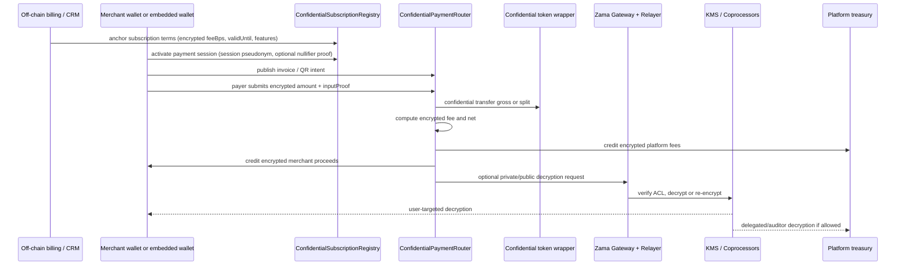
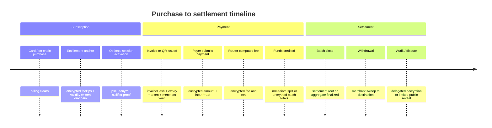

# Private Subscription Tiers for a Zama-Based Privacy Payments Platform

## Executive summary

A Zama-based design is a strong fit for **private fee schedules, confidential payment amounts, encrypted merchant balances, and selectively disclosed settlement records**. Zama’s stack gives you encrypted input submission with ZK proofs of knowledge, encrypted arithmetic directly in Solidity, ACL-based access control over ciphertext handles, and threshold-signed decryption through the protocol’s KMS. What it does **not** replace is wallet onboarding or social login: Zama’s relayer flow assumes the client already has a host-chain wallet or signer, so embedded-wallet or social-login infrastructure should sit **under** your Zama payment layer rather than be rebuilt inside it. citeturn30view0turn30view1turn31search0turn30view2turn33search1turn30view4

For your three plans, the best on-chain representation is **not** a public `enum {Free, Growth, Enterprise}`. Instead, store only the values that the payment contract actually needs: an **encrypted fee rate** (`50`, `25`, or custom basis points), an **encrypted validity window**, and an optional encrypted feature bitmask or quota. Keep the human-readable labels “Free,” “Growth,” and “Enterprise” in your off-chain billing system. That keeps the subscription tier itself private and also naturally supports Enterprise custom pricing. Zama’s own protocol fee model follows a similar “monthly plan + reduced per-operation fee” pattern at the infrastructure layer, although your merchant plans would still be an application-layer feature you build yourself. citeturn22search0turn29search1

The most practical architecture is a **two-stage roadmap**. In a **ship-fast v1**, use a pseudonymous merchant commitment or dedicated merchant vault address, store encrypted fee parameters on-chain, and let the contract compute fees privately at payment time or during batched settlement. In a **higher-privacy v2**, add a conventional SNARK verifier for session activation and one-time nullifiers if you need the merchant’s subscription usage to be less publicly linkable across payments. Zama natively covers the private computation part very well; the fully unlinkable membership-proof part is where you should add a separate ZK membership layer. citeturn30view0turn30view1turn30view2turn33search2turn39view0

Official sources also point to a clear ecosystem split. As of May 8, 2026, the first-party urlZamaturn38search0 user apps center on Portfolio, Staking, and Bridge-related flows rather than social login, and I did not find an official Zama-native equivalent to urlPrivyturn15view0, urlDynamicturn15view6, urlMetaMask Embedded Walletsturn15view7, or urlTurnkeyturn15view8. The closest wallet-infrastructure integration in official Zama material is urlDfnsturn19search1, which announced native ERC-7984 confidential-token support in its wallet and transaction stack. citeturn35search0turn25view0turn26view1

## What Zama can and cannot verify privately

Zama gives you three native verification primitives that matter for subscriptions and payments. First, payer-supplied encrypted inputs are accompanied by **ZK proofs of knowledge** so the protocol can verify the ciphertext is well formed without revealing the plaintext. Second, those encrypted inputs are **bound to the caller and the target contract**, which prevents simple replay by another user or in another contract. Third, decryptions are **ACL-gated** and returned with threshold-KMS signatures so private or public disclosures can be audited later. citeturn30view0turn30view1turn30view2turn33search1

That means “private verification” can be split into two different goals. If your goal is **private fee computation**, Zama already does that very well: the contract can read an encrypted fee rate, multiply it against an encrypted amount, and produce encrypted fee and net results without revealing the plan. If your goal is **unlinkable entitlement proof**, where outsiders should not even be able to correlate a merchant’s subscription authorization across transactions, Zama alone is not the whole answer. In that case you add a separate SNARK-style membership/session proof on top of the Zama payment logic, while leaving the fee arithmetic itself inside Zama. citeturn2view0turn31search0turn39view0

This distinction matters because Zama is strongest where you want **programmable confidentiality over on-chain state**, not where you want a full replacement for anonymous-credentials infrastructure or embedded-wallet custody. In other words: use Zama to hide tier-dependent fee logic and private balances; use a wallet/auth stack for onboarding; and, if required, use an ordinary SNARK verifier for unlinkable entitlement activation. That is also consistent with Zama’s own positioning around confidential finance, identity abstraction, selective disclosure, and delegated decryption rather than wallet onboarding itself. citeturn22search0turn25view0turn26view1

## Recommended architecture for private tiers

The cleanest design is to separate **billing identity**, **merchant pseudonym**, and **payment-session identity**.

Your off-chain billing system knows the real merchant record and the human plan name. On-chain, the registry knows only a `merchantCommitment` and encrypted fee terms. For each invoice or QR flow, the merchant activates an ephemeral `sessionPseudonym`, ideally with a one-time nullifier, and the payment router uses that session to look up encrypted fee terms without ever exposing “Growth” or “Enterprise” publicly. This keeps the operational contract simple and keeps the user-facing tier private. The underlying architecture matches the way Zama splits responsibilities across host contracts, coprocessors, the Gateway, the KMS, and the relayer. citeturn2view1turn30view2turn33search2turn33search1turn30view4

| Design | How subscription is represented | Privacy outcome | Operational complexity | Best use |
|---|---|---|---|---|
| FHE-only pseudonymous registry | `merchantCommitment -> {eFeeBps, eValidUntil, eFeatureMask}` | Tier hidden; commitment still linkable across activity | Low | Best v1 |
| FHE registry plus rotating session keys | Base registry plus per-order `sessionPseudonym` authorized by merchant key | Tier hidden; payment sessions less linkable than static merchant key | Medium | Best default for production |
| FHE plus SNARK session activation | SNARK proves valid entitlement and nullifier freshness before session creation | Strongest merchant unlinkability short of full note/UTXO design | High | Best for high-privacy or institutional deployments |
| Off-chain attested fee quote | Platform signs fee quote and anchors hash on-chain | Weakest trust model; easier migration path | Low | Transitional or hybrid rollout |

The recommended production path is **FHE registry + rotating sessions**, then add the SNARK session layer only if your threat model truly requires public-chain observers to have a harder time correlating merchant activity. The reason is simple: Zama already makes **tier privacy** easy; the harder and more expensive problem is **identity unlinkability** across recurring commerce. citeturn30view0turn31search0turn39view0



This interaction split is consistent with Zama’s documented model: host contracts manage ACL and symbolic logic; coprocessors verify encrypted inputs and execute FHE operations; the Gateway coordinates validation, decryption, and bridging; and the relayer can abstract Gateway-chain operations away from end users. citeturn2view1turn30view2turn33search2turn33search1turn30view4

### Contract interfaces and pseudocode

A practical contract set is: a `ConfidentialSubscriptionRegistry`, a `ConfidentialPaymentRouter`, a `SettlementVault`, and an optional `MembershipVerifier` for the SNARK/session layer.

```solidity
// SPDX-License-Identifier: MIT
pragma solidity ^0.8.27;

// Pseudocode only: function names and token interfaces will vary by library version.

interface IConfidentialToken {
    function confidentialTransfer(address to, euint64 amount) external returns (euint64 sent);
    function confidentialTransferFrom(address from, address to, euint64 amount) external returns (euint64 sent);
    function confidentialBalanceOf(address who) external view returns (euint64);
}

interface IMembershipVerifier {
    function verifySessionProof(
        bytes32 merkleRoot,
        bytes32 merchantCommitment,
        bytes32 sessionPseudonym,
        bytes32 nullifier,
        uint64 epoch,
        bytes calldata proof
    ) external view returns (bool);
}

contract ConfidentialSubscriptionRegistry is ZamaEthereumConfig {
    using FHE for *;

    struct EncTerms {
        euint16 feeBps;        // 50 for Free, 25 for Growth, custom for Enterprise
        euint48 validUntil;    // encrypted expiry/end of paid period
        euint32 featureMask;   // optional encrypted flags
        uint64 version;        // public version counter for race handling
    }

    mapping(bytes32 => EncTerms) internal termsByMerchantCommitment;
    mapping(bytes32 => bytes32) public activeSessionToMerchant;
    mapping(bytes32 => bool) public usedNullifier;

    address public platformAdmin;
    IMembershipVerifier public verifier;

    function anchorSubscriptionTerms(
        bytes32 merchantCommitment,
        externalEuint16 feeBpsExt,
        externalEuint48 validUntilExt,
        externalEuint32 featureMaskExt,
        bytes calldata inputProof
    ) external onlyPlatformAdmin {
        EncTerms storage t = termsByMerchantCommitment[merchantCommitment];
        t.feeBps = FHE.fromExternal(feeBpsExt, inputProof);
        t.validUntil = FHE.fromExternal(validUntilExt, inputProof);
        t.featureMask = FHE.fromExternal(featureMaskExt, inputProof);
        t.version += 1;

        FHE.allowThis(t.feeBps);
        FHE.allowThis(t.validUntil);
        FHE.allowThis(t.featureMask);
    }

    function activateSessionSimple(
        bytes32 merchantCommitment,
        bytes32 sessionPseudonym
    ) external onlyMerchantAuth {
        activeSessionToMerchant[sessionPseudonym] = merchantCommitment;
    }

    function activateSessionWithProof(
        bytes32 merkleRoot,
        bytes32 merchantCommitment,
        bytes32 sessionPseudonym,
        bytes32 nullifier,
        uint64 epoch,
        bytes calldata zkProof
    ) external {
        require(!usedNullifier[nullifier], "nullifier used");
        require(
            verifier.verifySessionProof(
                merkleRoot,
                merchantCommitment,
                sessionPseudonym,
                nullifier,
                epoch,
                zkProof
            ),
            "bad proof"
        );
        usedNullifier[nullifier] = true;
        activeSessionToMerchant[sessionPseudonym] = merchantCommitment;
    }

    function getTermsForSession(bytes32 sessionPseudonym)
        external
        returns (euint16 feeBps, euint48 validUntil, euint32 featureMask)
    {
        bytes32 merchantCommitment = activeSessionToMerchant[sessionPseudonym];
        EncTerms storage t = termsByMerchantCommitment[merchantCommitment];
        return (t.feeBps, t.validUntil, t.featureMask);
    }
}

contract ConfidentialPaymentRouter is ZamaEthereumConfig {
    using FHE for *;

    ConfidentialSubscriptionRegistry public registry;
    address public platformFeeVault;

    struct PaymentIntent {
        bytes32 sessionPseudonym;
        address token;
        bytes32 invoiceHash;
        uint64 expiresAt;
        address merchantVault;
        bytes32 metadataHash; // hash of off-chain invoice/order metadata
    }

    event PaymentAccepted(bytes32 indexed invoiceHash, bytes32 indexed sessionPseudonym);

    function payInvoice(
        PaymentIntent calldata intent,
        externalEuint64 encryptedAmount,
        bytes calldata inputProof
    ) external {
        require(block.timestamp <= intent.expiresAt, "expired");

        euint64 amount = FHE.fromExternal(encryptedAmount, inputProof);
        (euint16 feeBps, euint48 validUntil,) = registry.getTermsForSession(intent.sessionPseudonym);

        ebool active = FHE.ge(validUntil, uint48(block.timestamp));
        euint64 safeAmount = FHE.select(active, amount, FHE.asEuint64(0));

        // fee = amount * feeBps / 10_000
        euint64 feeNum = FHE.mul(safeAmount, FHE.asEuint64(feeBps));
        euint64 fee = FHE.div(feeNum, 10_000);
        euint64 net = FHE.sub(safeAmount, fee);

        FHE.allowTransient(net, intent.token);
        FHE.allowTransient(fee, intent.token);

        IConfidentialToken(intent.token).confidentialTransferFrom(msg.sender, intent.merchantVault, net);
        IConfidentialToken(intent.token).confidentialTransferFrom(msg.sender, platformFeeVault, fee);

        emit PaymentAccepted(intent.invoiceHash, intent.sessionPseudonym);
    }
}
```

The FHE pieces in that pseudocode reflect Zama’s current Solidity model: externally encrypted values are ingested with `FHE.fromExternal`, encrypted values are managed by per-ciphertext ACL rules, and the main design discipline is to keep permissions narrow and prefer transient allowances where possible. The cryptographic input proofs are already part of the Zama path; the optional `verifySessionProof` is the extra non-Zama verifier you would add only for stronger unlinkability. citeturn30view0turn30view1turn31search0turn39view0

### ZK session-proof flow

If you add the SNARK layer, the circuit should prove only **authorization and freshness**, not the fee arithmetic itself. Let Zama handle the fee arithmetic.

A good circuit shape is:

- **Private witnesses:** merchant secret, leaf nonce, entitlement parameters, Merkle path.
- **Public inputs:** current registry root, `merchantCommitment`, `sessionPseudonym`, `nullifier`, `epoch`.
- **Constraints:**  
  - the merchant knows a leaf committed in the active subscription tree;  
  - the leaf commits to the same `merchantCommitment`;  
  - the entitlement is still valid for the given epoch;  
  - `sessionPseudonym = H(merchantSecret, orderNonce or sessionNonce)`;  
  - `nullifier = H(merchantSecret, billingPeriod or sessionNonce)`.

This proves “a currently entitled merchant activated this session” without revealing the human plan name or merchant identity. The FHE registry still stores the encrypted `feeBps`, and the payment router still computes `fee` and `net` homomorphically. That division of labor keeps the custom ZK circuit much simpler than trying to prove FHE ciphertext consistency inside the circuit itself. The caution from the Zama security literature is that replay resistance should come from **binding to identities and context** rather than naively hashing raw proof bytes, and that externally encrypted inputs are safest when they remain bound to the actual intended caller and contract. citeturn30view1turn39view0

## Payment flows and transaction responsibilities

For a merchant collection platform, the right mental model is that **billing and UX live mostly off-chain**, while **state that must remain auditable or enforceable lives on-chain in encrypted form**.

The parts that should be on-chain are: confidential token custody and transfer state, encrypted subscription terms needed for fee enforcement, payment/session nullifiers, settlement roots or batch aggregates if you batch, withdrawals, optional delegated decryption rights, and bridge requests when you move ciphertexts across host chains. Zama’s Gateway and relayer layers are already designed around input validation, decryption orchestration, and bridging attestations, and the relayer can pay Gateway-chain fees so your users do not need to hold entity["cryptocurrency","ZAMA","protocol token"] directly. citeturn30view2turn2view2turn30view4

The parts that should stay off-chain are: card billing, fiat reconciliation, invoice rendering, QR encoding, business identity/KYC records, webhook processing, human-readable tier names, customer support metadata, fraud scoring, and most analytics. When needed, you anchor hashes or version references on-chain rather than full plaintext records. That is the privacy-preserving version of a normal PSP architecture. citeturn22search0turn26view1

### Required on-chain transactions

| Transaction | Who should usually broadcast it | What must be included | Why it exists |
|---|---|---|---|
| Subscription anchor / renewal | Platform admin or platform relayer | `merchantCommitment`, encrypted `feeBps`, encrypted `validUntil`, encrypted feature flags, billing reference hash | Makes the merchant’s fee terms enforceable on-chain without revealing the tier |
| Session activation | Merchant or sponsored relayer | `sessionPseudonym`, optional `nullifier`, optional SNARK proof/root/version | Lets later payments use ephemeral session identifiers instead of a static merchant key |
| Invoice / QR intent publication | Merchant backend or platform backend | `invoiceHash`, token address, expiry, merchant vault, metadata hash | Anchors a payment intent without exposing full invoice plaintext |
| Payment / scan-to-pay execution | Payer or sponsored relayer | encrypted amount handle + `inputProof`, `invoiceHash`, `sessionPseudonym` | Performs the confidential payment and fee computation |
| Settlement batch | Platform batcher | batch id, included payment root or aggregate references, destination vaults | Reduces cost and improves privacy when using net settlement |
| Withdrawal / sweep | Merchant or platform | destination, encrypted amount or aggregate handle, compliance reference if needed | Moves accumulated confidential proceeds out of the clearing vault |
| Delegated decryption grant / audit request | Platform or compliance admin | ciphertext handles, authorized delegate, case hash | Supports auditor/regulator access without public disclosure |
| Bridge | Platform or merchant treasury | source handle, target chain/registry references | Moves confidential balances across supported chains |

When you want the platform itself to sponsor and operationalize transactions, there are now multiple ways to do it. Zama’s relayer SDK already abstracts Gateway-chain operations behind HTTP and only requires a wallet on the host chain, and urlOpenZeppelinturn39view0 announced Zama FHEVM support in its Relayer product on May 6, 2026. For high-assurance operational signing, the wallet-infra route via urlTurnkeyturn15view8 or urlDfnsturn19search1 is also credible. citeturn30view4turn8search13turn26view1

### When to apply the fee

| Fee timing | Privacy | Operational simplicity | Cash-flow profile | Best fit |
|---|---|---|---|---|
| Payment-time split | Good, but each payment materializes fee immediately | Highest simplicity | Platform paid immediately | Best v1 for QR and invoice payments |
| Settlement-time batch fee | Better, because per-order fee is not separately materialized | More complex accounting | Platform accrues receivable until settlement | Best for higher privacy and large merchants |
| Hybrid | Good balance | Medium | Near-real-time with daily batch netting | Best long-term default |

For a first launch, **payment-time split** is the easiest to reason about and easiest to reconcile. For a privacy-maximal design, **settlement-time batching** is stronger because you can keep per-payment order-level math inside encrypted running totals and decrypt only the batch totals or grant delegated access only when needed. The trade-off is that the platform temporarily takes settlement risk. That trade-off is an application-level design choice, not a Zama limitation. Zama’s protocol fee model also makes batching economically attractive because decryptions and proof verifications are metered separately from pure FHE computation. citeturn29search1turn25view0

## Subscription lifecycle and private entitlement

Your subscription lifecycle should treat **entitlement** as the on-chain truth and **billing** as the off-chain truth.

A card or fiat purchase should usually happen off-chain with your normal billing processor or ramp flow. Once the payment clears, your backend anchors a new encrypted fee rate and validity interval on-chain. An on-chain purchase flow is also straightforward: the merchant pays in a confidential token, and the same transaction updates the encrypted entitlement record. In both cases, the human plan label can stay off-chain while the enforceable `feeBps` and `validUntil` live on-chain. Zama’s own protocol update also highlights confidential onramp-style user flows and official confidential wrappers for assets such as entity["cryptocurrency","USDC","stablecoin"], entity["cryptocurrency","USDT","stablecoin"], and entity["cryptocurrency","WETH","wrapped ether token"], which is useful for your payment and subscription revenue rails. citeturn25view0turn34search3

Renewals should not be modeled as “change tier publicly.” They should be modeled as **write a new encrypted version** of the entitlement terms. Cancellations should usually mean “no further renewal after `validUntil`,” not “emit a public cancellation event tied to the Growth label.” Upgrades and downgrades should be versioned and ideally epoch-based, so an in-flight invoice is always tied to the expected fee schedule and cannot later become ambiguous. That version discipline is more important than it sounds because confidential systems tolerate fewer “silent assumptions” than public ones. citeturn25view0turn39view0

Enterprise entitlements fit especially well in this model. You do not need a separate public on-chain Enterprise state at all. You simply write a custom encrypted `feeBps`, custom feature bits, and custom delegated decryption rights for support, auditors, or regulators where necessary. Zama’s recent delegated-decryption work is directly relevant here because it allows selected parties such as custodians, compliance providers, or regulators to access exactly the ciphertexts they are allowed to see, without making those values public to everybody else. citeturn25view0turn26view2



That timeline reflects Zama’s documented payment components: encrypted inputs with ZKPoKs, Gateway-mediated validation and decryption workflows, ACL-based selective disclosure, and optional confidential token wrappers for shielding and unshielding. citeturn30view0turn30view2turn31search0turn25view0turn35search0

## Security, privacy guarantees, trade-offs, and cost

The strongest guarantee in this design is that **tier-dependent fee logic can execute on-chain without publicly revealing the fee tier or the payment amount**. If you store only encrypted `feeBps`, encrypted validity, and encrypted balances, then public observers do not learn whether a merchant is on 0.5%, 0.25%, or a custom enterprise rate merely by watching the chain. They still see metadata such as timing, gas sponsor, invoice publication pattern, token contract, and any stable public pseudonyms you choose to expose. Privacy is therefore strong at the **data** layer and weaker at the **metadata** layer unless you deliberately design around linkability. citeturn22search0turn31search0turn26view2

The biggest architectural trade-off is between **privacy** and **simplicity**. A static `merchantCommitment` keyed registry is easy and already hides the fee tier, but activity against the same commitment remains publicly linkable. Rotating sessions improve this. A full note-like or stronger anonymous-membership design improves it more, but the cost is circuit complexity, more state transitions, more nullifier handling, and a more complex debugging surface. Zama’s native docs and security guidance support the encrypted-computation side of this design very well, but they do not currently provide a turn-key anonymous-membership primitive comparable to a dedicated private-note system. citeturn30view0turn39view0

The main contract-level attack vectors are already familiar in Zama-specific security guidance. **Unchecked encrypted arithmetic** can silently wrap and undercharge if you do not cap inputs before multiplication. **Over-broad ACL permissions** can turn helper contracts into disclosure oracles if you use persistent allowances carelessly instead of `allowTransient` plus `isSenderAllowed` checks. **Transient allowance bleed under account abstraction** can leak permissions across multiple user operations in a bundled transaction unless transient storage is cleaned between operations. **Third-party caller replay** becomes a real issue if you encrypt values for an intermediate contract instead of the actual intended sender context. And **async decryption callbacks** need replay/finality discipline because the value being revealed can itself be financially significant. citeturn39view0

At the protocol-cost level, Zama’s own litepaper is unusually helpful. The protocol charges for **input ZKPoK verification**, **decryption**, and **bridging**, not for the FHE arithmetic itself. The initial published fee ranges are roughly **$0.5 to $0.005** for ZKPoK verification, **$0.1 to $0.001** per decryption, and **$1 to $0.01** for bridging, depending on discount tier. Zama’s example for a confidential token transfer gives a total protocol-cost range of about **$0.008 to $0.8** before ordinary host-chain gas. Zama also notes that confidential operations cost more gas than plain operations, so exact host-chain gas must be benchmarked on your target chain and token path rather than assumed from public ERC-20 norms. citeturn29search1turn29search0

That leads to a practical cost recommendation. If you care about privacy and cost at scale, optimize to reduce **decryptions**, not just calldata. For example, batching merchant settlement lets you keep per-order fee math encrypted while paying for fewer total reveals. If you want a live receipt screen, private user-targeted decryption through the SDK is fine, but do not decrypt more often than the product actually requires. Also remember that Zama itself has a monthly developer-plan concept for reducing infrastructure fees; your merchant plans should be designed independently from that underlying protocol subscription. citeturn29search1turn25view0

## Social login and wallet infrastructure on top of Zama

Zama is a good substrate **for private payment logic**, but it is **not** a direct substitute for the four social-login and wallet-infrastructure vendors you named. The reason is straightforward: Zama’s relayer and SDK tooling assume you already have an EVM-capable signer. So the social-login layer should handle authentication, wallet creation, recovery, and user session management; the Zama layer should handle encrypted business logic, balances, fees, compliance, and selective disclosure. citeturn30view4turn25view0

Official Zama sources do not presently show a first-party social-login or embedded-wallet product comparable to the mainstream wallet-onboarding vendors. Current first-party user apps focus on Portfolio and Staking, and the most relevant official wallet-stack integration I found is the urlDfnsturn19search1 announcement around native confidential token support. In practice, that means your question is not “Can Zama replace Privy, Dynamic, Web3Auth, or Turnkey?” but rather “Which wallet/auth stack should sit in front of my Zama payment contracts?” citeturn35search0turn25view0turn26view1

| Provider | Strongest fit with Zama | What primary sources support | Main advantages | Main drawbacks |
|---|---|---|---|---|
| urlPrivyturn15view0 | Consumer-facing onboarding with embedded + external wallets | Supports embedded wallets on “hundreds of blockchains,” external wallets, key export, server-controlled workflows, and any EVM-compatible chain or app-specific chain. citeturn15view1turn15view2turn15view3 | Fastest path for polished UX, external-wallet fallback, strong React ecosystem, good if you want your Zama app to feel like Web2 | More wallet-product-oriented than policy-engine-oriented; less natural than Turnkey for deep backend approval logic |
| urlDynamicturn15view6 | Consumer onboarding plus MPC wallets and custom chain config | Embedded wallets sign with secure MPC, can export keys client-side, and support adding custom EVM networks. Policies/rules exist for many networks. citeturn15view4turn15view5turn15view6turn10search2 | Strong consumer UX, transaction simulation, custom EVM network support, decent compliance/user-management surface | Backend treasury and signing orchestration are not as core to the product story as with Turnkey or Dfns |
| urlMetaMask Embedded Walletsturn15view7 | Broad auth flexibility and cross-platform onboarding | Supports OAuth/social, custom JWT/OIDC auth, distributed MPC/TSS-style architecture, and chain-agnostic wallet flows. citeturn15view7turn16search0turn16search3turn16search8turn16search10 | Very flexible auth story, good cross-platform coverage, strong fit if you already have JWT/OIDC identity | More moving parts and auth-configuration complexity than a simple drop-in wallet modal |
| urlTurnkeyturn15view8 | Backend custody, policy-controlled signing, relayers, treasury ops | Supports passkeys, email/SMS, OAuth/social, session management, embedded-wallet sub-organizations, and EVM signing across EVM chains with transaction management and gas sponsorship. citeturn15view8turn15view9turn15view10turn15view11turn17search0turn17search1 | Best fit for platform-controlled settlement signers, approval policies, and backend operations around withdrawals, treasury, and admin txs | More infrastructure-heavy and lower-level for pure consumer onboarding than Privy or Dynamic |

The most sensible deployment pattern is usually: **Privy or Dynamic** for merchant and payer onboarding in the frontend, **Turnkey** for backend relayers/treasury/admin transactions, and **Zama** for the confidential payment and settlement contracts. If you are institutional-first rather than consumer-first, the closest ecosystem-adjacent precedent is **Dfns + Zama** for confidential wallet/transaction infrastructure. citeturn15view1turn15view4turn17search0turn26view1

There is one important caveat. If you use smart-wallet, account-abstraction, or bundled-ops flows together with FHEVM, you must account for Zama’s transient-storage model. OpenZeppelin’s FHEVM security guidance explicitly warns that multiple user operations sharing one transaction can accidentally share transient FHE permissions unless cleanup is handled carefully. That is especially relevant if you combine Zama with sponsored transactions or smart-wallet products. citeturn39view0

## Demo scenarios, open questions, and primary links

### Free tier demo

A small merchant signs in with social login, receives a dedicated merchant vault, and is placed on a plan whose on-chain record contains encrypted `feeBps = 50` and encrypted expiry. The merchant displays a scan-to-pay QR that resolves to an off-chain invoice endpoint. The backend returns a payment intent containing `invoiceHash`, supported asset, expiry, and the merchant’s session pseudonym. The payer submits an encrypted amount plus Zama input proof; the router computes a private 0.5% fee and either splits immediately or adds gross and fee to encrypted running totals. The merchant can decrypt only its own resulting balance or receipt handle. The public chain never learns that the merchant was “Free tier”; it only sees a payment against a pseudonymous target. This is the fastest demo to ship. citeturn30view0turn30view1turn31search0turn25view0

### Growth tier demo

A mid-market merchant pays $99/month off-chain. Your billing backend anchors a new encrypted `feeBps = 25` record with a new entitlement version. The merchant’s backend creates invoices for backend-specified orders rather than static QR amounts. At payment time, the router uses the active encrypted rate to compute 0.25% privately. At the end of the day, the platform runs a settlement batch that decrypts only the merchant’s daily net total to the merchant and the daily fee total to the platform, rather than decrypting every order. This demo shows the strongest product-market fit for invoice commerce because it combines private fee enforcement with lower per-order reveal overhead. citeturn29search1turn25view0

### Enterprise tier demo

An enterprise merchant has a custom encrypted `feeBps`, custom feature flags, and a delegated decryption policy allowing a nominated compliance key to access selected payment records. The merchant activates a session with an additional membership/session proof and uses batched settlement rather than immediate per-order fee transfers. The platform can later grant a regulator or auditor access to a specific set of ciphertexts by delegated decryption, without making those values public to the world. This is the tier where Zama’s selective disclosure story becomes a product differentiator rather than just a privacy enhancement. citeturn25view0turn26view2turn33search1

### Open questions and limitations

The main unresolved item is **how far you want to go on unlinkability**. Hiding the fee tier is straightforward with Zama. Hiding that multiple payments belong to the same anonymous merchant commitment is harder and usually requires rotating session identifiers, note-like accounting, or a separate anonymous-membership design. Official Zama documentation strongly supports the encrypted-computation side of this, but it does not currently present a first-party, turn-key anonymous-membership primitive for recurring merchant subscriptions. That part remains application architecture. citeturn30view0turn39view0

The second unresolved item is **exact host-chain gas**. Zama publishes protocol-level fee ranges and explicitly notes that confidential operations cost more gas, but exact gas for your payment router, invoice flow, and settlement choice depends on the host chain, wrapper/token path, calldata size, whether you decrypt receipts, and whether you batch. You should therefore treat the published protocol fee ranges as the portable part and benchmark host-chain gas locally before fixing pricing. citeturn29search1turn29search0

### Primary links and projects

Core protocol and SDK references:

- urlZama Protocol docsturn20search1  
- urlFHEVM repositoryturn2view4  
- urlFHEVM whitepaperhttps://github.com/zama-ai/fhevm/blob/main/fhevm-whitepaper.pdf  
- urlRelayer SDKturn8search0  
- urlZama SDK update and delegated decryption overviewturn25view0  
- urlOpenZeppelin confidential contracts examplesturn34search3  
- urlDfns confidential-token integration with Zamaturn25view1  

Wallet and social-login references:

- urlPrivy docsturn15view0  
- urlDynamic docsturn15view6  
- urlMetaMask Embedded Wallets docsturn15view7  
- urlTurnkey docsturn15view8